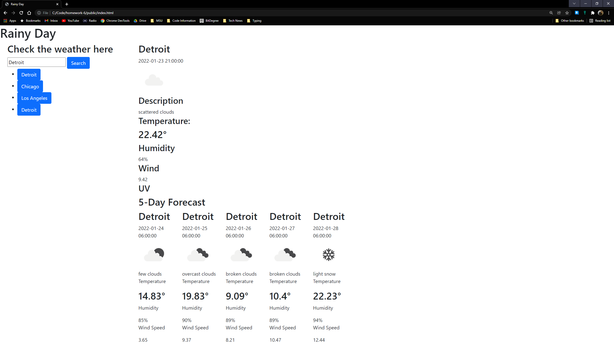

  # Rainy Day 
  
  Weather application for travel or at home use. 

  

  ### Table of Contents
  - [Technologies Used](#tech)
  - [Installation](#installation) 
  - [Usage](#usage) 
  - [Contributing](#contributing) 
  - [Tests](#tests)
  - [Contact Me](#contact-me)
  
---
  ###  Technologies Used
  
  - JavaScript
  - CSS
  - HTML
  - NodeJS

  ###  Installation 
  - `This application is hosted by GitHub Pages and is accessible to anyone with an internet connection.`

Go to the included link to visit the site. Enter in a city of your choosing and see what the weather will be like.
  ###  Tests
  Coming soon...
  ###  Contact Me
  If you have any questions. You can reach me at [my Github](https://www.github.com/letqin) or you can email me at: letqin@gmail.com.
  
  ###  Links

  - [Repo](https://github.com/letqin/homework-6)
  - [Deployed App](https://letqin.github.io/homework-6/index.html)
 